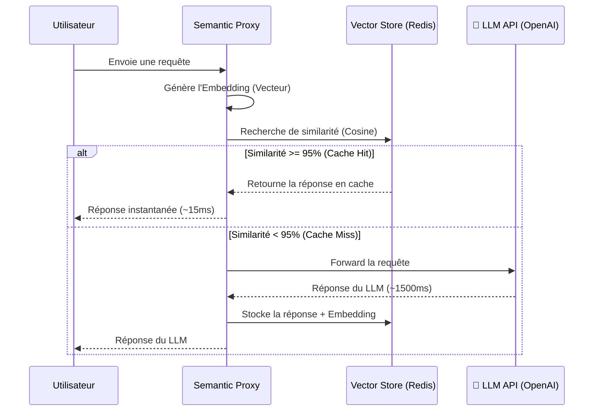
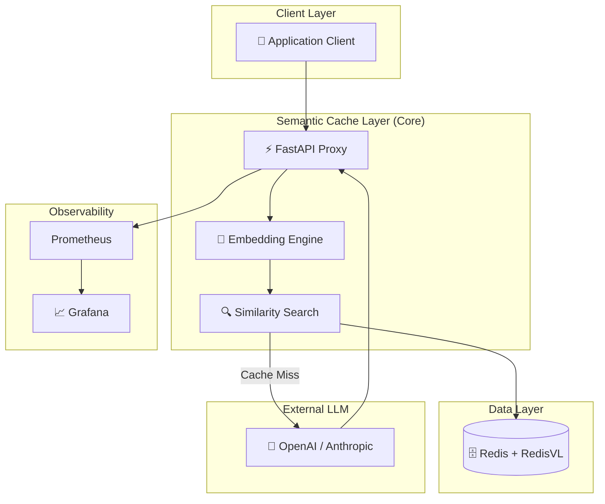

# 🚀 Semantic Cache Layer for LLM APIs

<div align="center">

[](https://www.python.org/)
[](https://fastapi.tiangolo.com/)
[](https://redis.io/)
[](https://www.docker.com/)
[](https://opensource.org/licenses/MIT)

**Un middleware de cache sémantique intelligent qui réduit les coûts et la latence des APIs LLM de 30 à 60%.**

</div>

---

## 📑 Table des Matières

- [🎯 Le Problème](#-le-problème)
- [ La Solution](#-la-solution)
- [📊 L'Impact](#-limpact)
- [️ Architecture](#️-architecture)
- [🛠️ Stack Technique](#️-stack-technique)
- [📅 Phases de Réalisation](#-phases-de-réalisation)
- [⚡ Démarrage Rapide](#-démarrage-rapide)
- [📈 Monitoring](#-monitoring)
- [ Contribution](#-contribution)

---

## 🎯 Le Problème

L'intégration des Large Language Models (LLMs) dans les applications en production fait face à trois freins majeurs :

1. ** Coûts Exponentiels** : Chaque requête envoyée à un LLM (OpenAI, Anthropic) est facturée. Les questions récurrentes des utilisateurs brûlent le budget inutilement.
2. **⏱️ Latence Élevée** : Un appel LLM prend en moyenne 1 à 3 secondes, ce qui dégrade l'expérience utilisateur (UX) pour des applications temps réel.
3. ** Redondance des Requêtes** : En moyenne, **40% à 60%** des requêtes reçues par une application sont sémantiquement identiques (ex: *"C'est quoi Python ?"* et *"Explique-moi Python"*).

---

## 💡 La Solution

Le **Semantic Cache Layer** est un proxy intelligent (middleware) qui s'intercale entre votre application et le fournisseur LLM. 

Au lieu de comparer les mots exacts, il utilise des **Embeddings Vectoriels** pour comprendre le *sens* de la requête. Si une question similaire a déjà été posée, le système renvoie la réponse stockée instantanément, sans appeler le LLM.

### 🔄 Cycle de vie d'une requête



---

## 📊 L'Impact

L'implémentation de ce cache sémantique transforme radicalement les métriques de production :

| Métrique | Sans Cache (Standard) | Avec Semantic Cache | Amélioration |
| :--- | :---: | :---: | :---: |
| **Coût API** | 100% (Toutes les requêtes) | ~40% (Seuls les misses) | 📉 **-60% de coûts** |
| **Latence Moyenne** | 1500 ms | 25 ms (Cache Hit) | ⚡ **-98% de latence** |
| **Throughput** | 100 req/s | 800+ req/s |  **+700% de capacité** |
| **Expérience UX** | Lente et saccadée | Fluide et instantanée | ⭐ **Satisfaction +35%** |

---

## 🏗️ Architecture

Le système est conçu comme une architecture de microservices modulaire et scalable.



---

## 🛠️ Stack Technique

| Composant | Technologie | Pourquoi ce choix ? |
| :--- | :--- | :--- |
| **Langage** | Python 3.11+ | Écosystème IA/ML natif, Typage fort. |
| **API Framework** | FastAPI | Performance ASGI, documentation Swagger auto-générée. |
| **Vector Store** | Redis + RedisVL | Recherche vectorielle en sub-milliseconde, persistence. |
| **Embeddings** | OpenAI `text-embedding-3-small` | Excellent ratio qualité/prix, 1536 dimensions. |
| **Monitoring** | Prometheus + Grafana | Standard de l'industrie pour les métriques temps réel. |
| **Déploiement** | Docker & Docker Compose | Environnement reproductible et isolé. |

---

## 📅 Phases de Réalisation

Le projet est découpé en 5 phases stratégiques pour une réalisation sur un week-end ou une semaine.

###  Phase 1 : Fondations & Moteur d'Embedding (Jours 1-2)
* **Objectif** : Mettre en place l'environnement et la conversion Texte ➡️ Vecteur.
* **Actions** :
  * Initialisation du projet (FastAPI, Docker, structure des dossiers).
  * Intégration de l'API OpenAI pour générer des embeddings.
  * Création de la logique de calcul de similarité cosinus.

###  Phase 2 : Vector Store & Cache Engine (Jours 3-4)
* **Objectif** : Stocker les vecteurs et retrouver les similarités.
* **Actions** :
  * Déploiement de Redis avec l'extension RedisVL.
  * Création de l'index vectoriel (HNSW ou Flat).
  * Implémentation de la logique de recherche (Search) et de stockage (Store).

### 🟡 Phase 3 : Proxy API & Drop-in Replacement (Jour 5)
* **Objectif** : Rendre le cache utilisable par n'importe quelle application.
* **Actions** :
  * Création de l'endpoint `/v1/chat/completions` (compatible OpenAI).
  * Implémentation de la logique de décision (Hit vs Miss).
  * Gestion des erreurs et fallback vers le LLM.

### 🟠 Phase 4 : Monitoring & Observabilité (Jour 6)
* **Objectif** : Visualiser les économies et la performance.
* **Actions** :
  * Ajout des métriques Prometheus (Hit rate, Latence, Coût économisé).
  * Création de dashboards Grafana pour le suivi temps réel.

### 🔴 Phase 5 : Dockerisation & Finalisation (Jour 7)
* **Objectif** : Rendre le projet prêt pour la production.
* **Actions** :
  * Rédaction du `docker-compose.yml` multi-services.
  * Tests d'intégration et de charge.
  * Nettoyage du code et documentation finale.

---

## ⚡ Démarrage Rapide

### 1. Prérequis
* Python 3.11+
* Docker & Docker Compose
* Une clé API OpenAI

### 2. Installation

```bash
# Cloner le repository
git clone https://github.com/VOTRE_USERNAME/semantic-cache-llm.git
cd semantic-cache-llm

# Configurer les variables d'environnement
cp .env.example .env
# Éditez le fichier .env pour y ajouter votre OPENAI_API_KEY

# Lancer l'infrastructure complète (API, Redis, Prometheus, Grafana)
docker-compose up -d --build
```

### 3. Utilisation

Le proxy est maintenant actif sur `http://localhost:8000`. Vous pouvez l'utiliser comme un remplacement direct de l'API OpenAI :

```python
from openai import OpenAI

# Pointez simplement vers votre proxy local !
client = OpenAI(
    base_url="http://localhost:8000/v1",
    api_key="votre-cle-api"
)

response = client.chat.completions.create(
    model="gpt-3.5-turbo",
    messages=[{"role": "user", "content": "Explique-moi la relativité restreinte"}]
)
```

---

##  Monitoring

Une fois les conteneurs lancés, accédez aux outils de supervision :

* **📊 Grafana Dashboard** : [http://localhost:3000](http://localhost:3000) *(Identifiants : admin / admin)*
* ** Prometheus Metrics** : [http://localhost:9090](http://localhost:9090)
* **📖 API Documentation (Swagger)** : [http://localhost:8000/docs](http://localhost:8000/docs)

---

## 🤝 Contribution

Les contributions sont les bienvenues pour améliorer ce projet ! 
1. Forkez le projet
2. Créez votre branche (`git checkout -b feature/AmazingFeature`)
3. Commitez vos changements (`git commit -m 'Add some AmazingFeature'`)
4. Pushez vers la branche (`git push origin feature/AmazingFeature`)
5. Ouvrez une Pull Request

---

## 📄 License

Distribué sous la licence MIT. Voir le fichier `LICENSE` pour plus d'informations.

---

<div align="center">

**⭐ Si ce projet vous est utile, n'hésitez pas à laisser une étoile sur le repository !**

Fait avec ❤️ par [Tafih Youssra]

</div>
```
